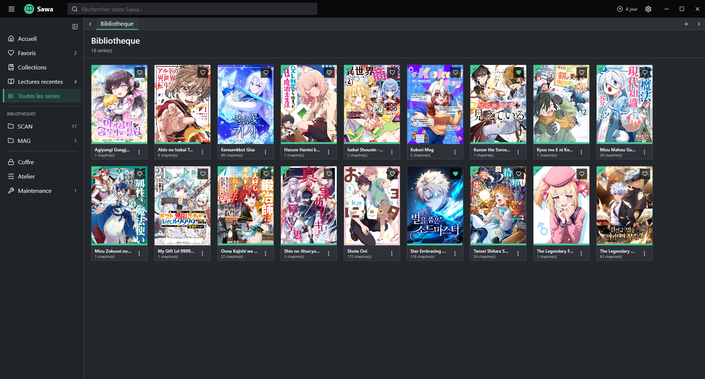
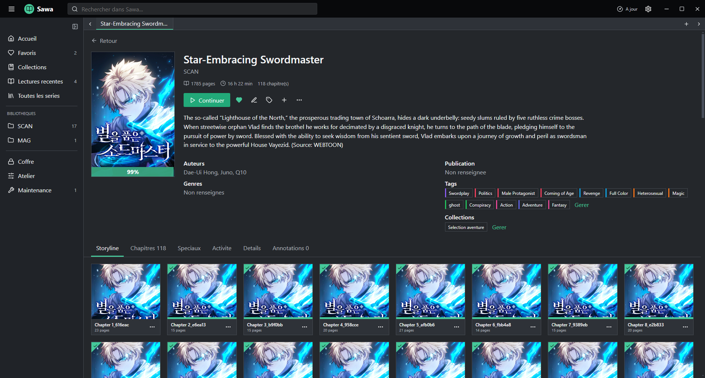
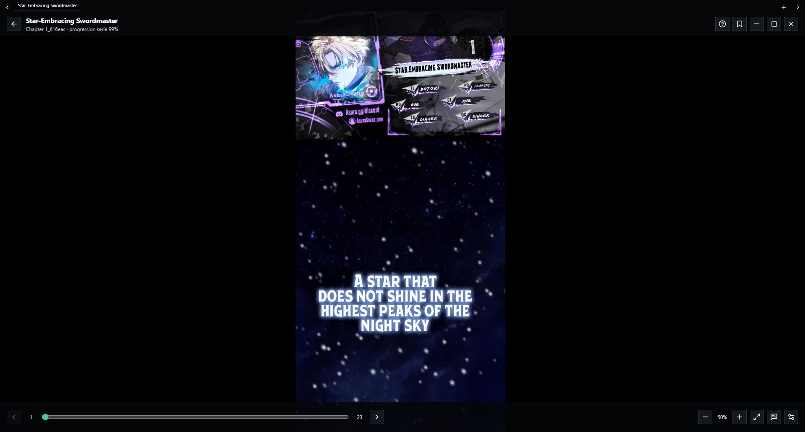
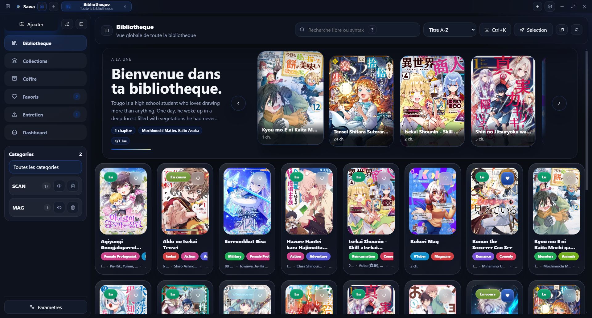
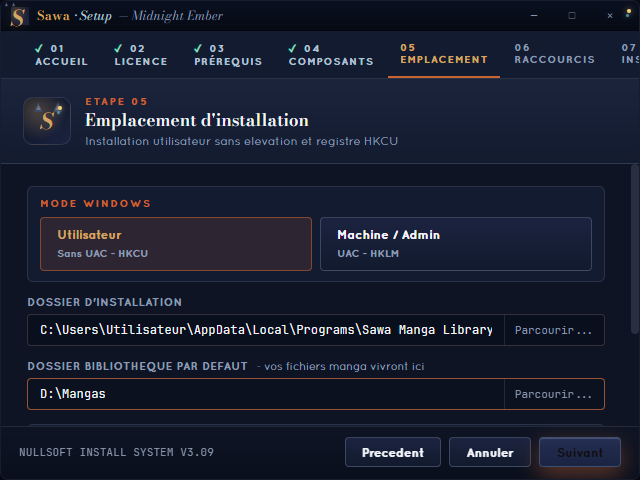

# Sawa Manga Library

Sawa Manga Library est une application Windows locale pour lire, organiser et enrichir une bibliothèque de mangas. Elle fonctionne sans compte et sans serveur distant obligatoire: les fichiers, la progression et les données utilisateur restent sur l'ordinateur.

[Télécharger les releases officielles](https://github.com/tsukihiro-nomel/Sawa-manga-reader/releases)

> Le dépôt prépare la version `4.0.0`. La release publique actuellement disponible peut encore correspondre à une version antérieure. Pour la v4, l'installateur attendu est `Sawa-Setup-4.0.0.exe`.

## Aperçu

### Interface Kavita

L'interface Kavita est utilisée par défaut sur les nouvelles installations. Elle privilégie une navigation classique, dense et légère.



### Fiche manga

La fiche rassemble progression, chapitres, métadonnées, tags, collections et actions de lecture.



### Lecteur

Le lecteur Kavita utilise un canvas noir plein écran, une barre d'onglets compacte et des contrôles superposés qui peuvent être masqués.



### Interface Sawa

L'interface historique Sawa reste disponible. Elle propose une présentation plus visuelle avec dashboard, carrousels et cartes enrichies.



### Installateur Windows

L'installateur personnalisé permet de choisir le mode utilisateur ou machine, le dossier du programme et la bibliothèque initiale.



Les captures utilisent uniquement des mangas de la bibliothèque locale normale, hors Coffre. Aucun visuel de démonstration n'a été généré par IA.

## Fonctionnalités

- Bibliothèques locales organisées par dossiers et catégories.
- Lecture de dossiers d'images, fichiers `PDF` et archives `CBZ`.
- Modes page simple, double LTR, double manga RTL, image découpée et webtoon.
- Recherche libre et filtres structurés.
- Tags colorés, favoris, collections manuelles et collections intelligentes.
- Progression, lu/non lu, lectures récentes, annotations et repères.
- Métadonnées locales, couvertures personnalisées et prise en charge de `ComicInfo.xml`.
- Interface multi-onglets avec réorganisation, clic molette et espaces de travail.
- Coffre privé avec PIN, masquage des couvertures, verrouillage et panic lock.
- Sources web optionnelles via le runtime local compatible Suwayomi/Mihon.
- Maintenance, diagnostics, OCR local à la demande et jobs d'arrière-plan.
- Deux interfaces indépendantes: `Kavita` et `Sawa`.
- Thèmes couleur séparés du choix d'interface.

## Formats Supportés

### Conteneurs

- dossiers de pages;
- `CBZ`;
- `PDF`.

Les associations Windows peuvent également proposer Sawa pour d'autres extensions, mais le scanner local documenté et validé dans cette version lit les dossiers d'images, les `CBZ` et les `PDF`.

### Images

`jpg`, `jpeg`, `png`, `webp`, `gif`, `bmp`, `avif`, `jfif`, `svg`, `tif` et `tiff`.

### Organisation Conseillée

```text
Ma Bibliothèque/
  Manga A/
    Chapitre 01/
      001.jpg
      002.jpg
    Chapitre 02.cbz
    Volume 03.pdf
    ComicInfo.xml

  Manga B/
    001.png
    002.png
```

Règles principales:

- le dossier ajouté à Sawa devient une catégorie;
- chaque sous-dossier direct devient un manga;
- un sous-dossier d'images, un `CBZ` ou un `PDF` devient un chapitre;
- des images directement placées dans le dossier du manga sont traitées comme un chapitre unique;
- `ComicInfo.xml` peut être lu depuis un `CBZ` ou comme fichier sidecar.

## Installation Windows

### 1. Télécharger Sawa

1. Ouvrez la page des [releases officielles](https://github.com/tsukihiro-nomel/Sawa-manga-reader/releases).
2. Pour la future release v4, téléchargez `Sawa-Setup-4.0.0.exe`.
3. Fermez une éventuelle instance de Sawa avant de lancer l'installation ou la mise à jour.

### 2. Avertissement SmartScreen

La configuration actuelle du dépôt ne déclare pas encore de certificat de signature Windows. SmartScreen peut donc afficher un éditeur inconnu.

N'utilisez `Informations complémentaires`, puis `Exécuter quand même`, que si l'installateur provient bien de la page GitHub officielle. Lorsqu'une somme de contrôle est publiée avec la release, vérifiez-la avant l'exécution.

### 3. Choisir Le Mode D'installation

| Mode | Emplacement par défaut | Registre | UAC | Usage conseillé |
| --- | --- | --- | --- | --- |
| Utilisateur | `%LOCALAPPDATA%\Programs\Sawa Manga Library` | `HKCU` | Non | Installation personnelle recommandée |
| Machine / Admin | `%ProgramFiles%\Sawa Manga Library` | `HKLM` | Oui | Ordinateur partagé ou installation pour tous les comptes |

Le mode Utilisateur est sélectionné par défaut et ne demande pas de droits administrateur.

### 4. Choisir Les Composants

L'installateur propose des profils complet, standard, minimal et personnalisé. Selon le paquet construit, les composants peuvent inclure:

- Sawa Core;
- runtime Sources web;
- Java 21 embarqué;
- thèmes additionnels;
- associations de fichiers et protocole `sawa://`;
- menu contextuel de l'Explorateur.

### 5. Choisir Les Dossiers

- **Dossier d'installation**: contient le programme.
- **Dossier bibliothèque par défaut**: contient vos mangas et peut être indexé au premier lancement.

Les fichiers manga n'ont pas besoin d'être placés dans le dossier du programme.

### 6. Raccourcis Et Premier Scan

L'installateur peut créer:

- un raccourci Bureau;
- une entrée Menu Démarrer;
- un démarrage automatique avec Windows.

Sur la dernière page, laissez l'option de scan initial activée pour ajouter automatiquement le dossier de bibliothèque choisi.

## Mise À Jour Et Réparation

Lancez l'installateur d'une version plus récente au-dessus de l'installation existante. Après la détection de la version présente:

- **Mettre à jour** remplace les binaires et conserve les données utilisateur;
- **Réparer** réinstalle les fichiers de l'application;
- **Désinstaller** ouvre le parcours de suppression.

Avant une mise à jour importante, exportez une sauvegarde `.sawa` depuis les paramètres.

## Désinstallation

Utilisez l'entrée de désinstallation du Menu Démarrer ou les paramètres Applications de Windows.

L'assistant permet de conserver séparément:

- les données utilisateur: progression, tags, collections, paramètres et Coffre;
- le dossier de bibliothèque contenant les mangas;
- les caches dérivés reconstructibles.

Conserver le dossier de bibliothèque est fortement recommandé. Les mangas locaux ne sont pas inclus dans une sauvegarde `.sawa`.

## Première Utilisation

### Ajouter Une Bibliothèque

Le moyen le plus simple est de sélectionner le dossier pendant l'installation et d'activer le scan initial.

Pour ajouter un autre dossier plus tard:

1. passez sur l'interface Sawa si nécessaire;
2. cliquez sur **Ajouter**;
3. choisissez **Ajouter des catégories**;
4. sélectionnez un ou plusieurs dossiers;
5. attendez la fin du job de scan affiché par l'application.

Une action légère comme un favori, un tag ou un statut lu ne doit pas déclencher de rescan complet.

### Choisir L'interface

Le choix de structure et le choix de couleurs sont indépendants.

1. Ouvrez **Paramètres**.
2. Dans **Interface**, choisissez `Kavita` ou `Sawa`.
3. Dans **Ambiance visuelle**, choisissez `Dark Night`, `Light Paper`, `Coffee House` ou `Neon City`.

Les deux interfaces utilisent la même bibliothèque, les mêmes onglets et les mêmes actions métier.

### Rechercher Et Filtrer

La barre accepte du texte libre, par exemple un titre ou un auteur. La recherche avancée accepte notamment:

```text
tag:romance
status:unread
favorite:true
private:false
author:"Inoue Takehiko"
collection:seinen
missing:cover
missing:metadata
chapters>10
added<30
```

Les filtres avancés peuvent être enregistrés comme collection intelligente.

### Organiser Un Manga

Depuis une carte, une fiche ou le menu `Plus`, vous pouvez:

- ajouter ou retirer un favori;
- marquer le manga ou un chapitre comme lu/non lu;
- assigner des tags;
- ajouter le manga à une collection;
- modifier les métadonnées;
- choisir une couverture;
- ajouter le manga à la queue de lecture;
- ouvrir dans un nouvel onglet ou en incognito;
- envoyer le contenu au Coffre.

### Utiliser Les Onglets

- clic normal: ouvrir dans l'onglet courant;
- clic molette ou `Ctrl+clic`: ouvrir en arrière-plan;
- `Shift+clic`: ouvrir et activer un nouvel onglet;
- clic molette sur un onglet: fermer;
- glisser-déposer: réorganiser;
- clic droit: afficher les actions avancées.

### Lire Un Chapitre

1. Ouvrez une fiche manga.
2. Cliquez sur **Lire** ou **Continuer**.
3. Choisissez un chapitre.
4. Utilisez le bouton de réglages du lecteur pour sélectionner:
   - page simple;
   - double LTR;
   - double manga RTL;
   - découpage d'image;
   - webtoon;
   - ajustement hauteur/largeur;
   - zoom, luminosité et largeur personnalisée.

Le lecteur sauvegarde la progression avec temporisation et précharge les pages voisines.

### Coffre Privé

1. Ouvrez **Coffre**.
2. Configurez un PIN d'au moins quatre caractères.
3. Activez éventuellement le flou des couvertures et le mode stealth.
4. Envoyez un manga ou une catégorie au Coffre depuis son menu.
5. Reverrouillez le Coffre après utilisation.

Quand le Coffre est verrouillé, les titres et compteurs privés ne doivent pas apparaître dans la bibliothèque normale.

### Sources Web

Les Sources web sont facultatives. Elles nécessitent l'addon intégré, un runtime compatible et Java 21 ou le JRE embarqué.

Les extensions communautaires proviennent de services tiers. Vérifiez leur origine et leurs conditions d'utilisation. Les chapitres importés deviennent des fichiers locaux dans la bibliothèque choisie.

### Maintenance Et Migration

La page Maintenance donne accès aux scans, diagnostics, caches, OCR et outils de migration.

SQLite Core v2 est encore une transition en cours:

- les JSON utilisateur restent conservés et restaurables;
- l'index SQLite dérivé reste reconstructible;
- une analyse et un backup précèdent la migration;
- le nettoyage du stockage legacy reste une action explicite.

N'effacez pas les anciens fichiers avant d'avoir vérifié la migration et la sauvegarde.

### Sauvegardes

L'export `.sawa` contient les données utilisateur, notamment:

- progression;
- favoris;
- tags et collections;
- paramètres;
- session et onglets;
- métadonnées locales;
- configuration du Coffre.

Les pages, `CBZ` et `PDF` de la bibliothèque ne sont pas inclus.

## Raccourcis Essentiels

Les raccourcis sont personnalisables dans **Paramètres > Raccourcis**.

| Action | Raccourci par défaut |
| --- | --- |
| Nouvel onglet | `Ctrl+T` |
| Fermer l'onglet actif | `Ctrl+W` |
| Onglet suivant | `Ctrl+Tab` |
| Onglet précédent | `Ctrl+Shift+Tab` |
| Onglets 1 à 8 | `Ctrl+1` à `Ctrl+8` |
| Dernier onglet | `Ctrl+9` |
| Palette de commandes | `Ctrl+K` |
| Paramètres | `Ctrl+,` |
| Replier la barre latérale | `Ctrl+B` |
| Queue de lecture | `Ctrl+Shift+Q` |
| Panic lock | `Ctrl+Shift+L` |
| Page suivante/précédente | `ArrowRight` / `ArrowLeft` |
| Chapitre suivant/précédent | `Ctrl+ArrowRight` / `Ctrl+ArrowLeft` |
| Masquer/afficher le lecteur | `H` |
| Plein écran | `F` |
| Zoom | `+`, `-`, `0` |
| Quitter le lecteur | `Escape` |

Dans le mode webtoon, `ArrowUp` et `ArrowDown` font un petit défilement, tandis que `PageUp` et `PageDown` déplacent approximativement d'un écran.

## Stockage Local

Le profil Windows se trouve par défaut dans:

```text
%APPDATA%\sawa-manga-library
```

État actuel:

- les JSON restent la source de vérité legacy pour les données utilisateur;
- SQLite sert à Core v2 et aux données dérivées, recherches, jobs et caches;
- les actions UI légères utilisent un snapshot mémoire pour éviter les scans disque;
- les caches peuvent être reconstruits depuis les JSON et les fichiers manga.

Ne modifiez pas manuellement ces fichiers pendant que Sawa est ouvert.

## Architecture

Sawa utilise:

- Electron pour l'application desktop;
- React pour les deux interfaces;
- Vite pour le build renderer;
- un preload limité exposé via `window.mangaAPI`;
- `better-sqlite3` pour les bases locales;
- des services séparés pour scanner, jobs, sources, OCR, archives et migration.

Garde-fous Electron:

- `contextIsolation: true`;
- `nodeIntegration: false`;
- aucun IPC fichier générique exposé au renderer;
- protocoles locaux contrôlés pour servir les pages;
- données privées du Coffre filtrées avant envoi au renderer verrouillé.

Kavita est une inspiration produit, UX et architecture: aucun code, HTML, CSS ou asset Kavita n'est copié dans Sawa.

## Développement

### Prérequis

- Windows pour tester l'application et le packaging complet;
- Node.js LTS récent;
- npm;
- Java 21+ uniquement si le runtime Sources web n'est pas embarqué.

### Installation

```bash
npm install
```

### Lancement

```bash
npm run dev
```

### Tests Et Builds

```bash
npm test
npm run build:web
npm run build:installer-ui
```

### Installateur Officiel

```bash
npm run dist:installer
```

L'artefact final est produit dans:

```text
release-installer/Sawa-Setup-4.0.0.exe
```

Le script construit successivement le backend NSIS, l'interface Electron de l'installateur et le wrapper final.

### Builds Alternatifs

```bash
npm run pack:dir
npm run dist:exe
npm run dist:msi
npm run dist:portable
npm run dist:win
```

Ces sorties Electron Builder utilisent principalement `release/` et restent des alternatives au parcours `dist:installer`.

## Validation Avant Release

```bash
npm test
npm run build:web
npm run build:installer-ui
npm run dist:installer
```

Vérifications manuelles recommandées:

- installation Utilisateur et Machine/Admin;
- mise à jour d'une installation existante;
- désinstallation avec conservation des données;
- scan initial puis ajout d'une autre catégorie;
- recherche, tags, favoris et collections;
- interface Kavita et interface Sawa;
- lecteur simple, double, RTL et webtoon;
- Coffre verrouillé/déverrouillé;
- Sources web si le runtime est disponible;
- migration et restauration d'un backup.

## Crédits Et Licences

Sawa utilise ou intègre notamment:

- Electron;
- React et React DOM;
- Vite;
- SQLite et better-sqlite3;
- PDF.js;
- TanStack Virtual;
- dnd-kit;
- lucide-react;
- react-pro-sidebar;
- chokidar;
- fast-xml-parser;
- yauzl;
- Electron Builder et NSIS;
- 7zip-bin;
- sudo-prompt;
- check-disk-space;
- Suwayomi Server et l'écosystème Tachiyomi/Mihon lorsque les Sources web sont activées;
- Kavita comme inspiration d'expérience et d'architecture.

Consultez [THIRD_PARTY_NOTICES.md](THIRD_PARTY_NOTICES.md) pour les notices et licences détaillées.

Les couvertures et pages visibles dans les captures restent la propriété de leurs auteurs, éditeurs et ayants droit respectifs. Elles servent uniquement à illustrer l'interface du logiciel.

## Limites Connues

- La cible principale et le packaging validé sont Windows.
- La release publique v4 doit encore être publiée séparément du code présent dans le dépôt.
- L'installateur peut déclencher SmartScreen tant qu'il n'est pas signé avec un certificat Windows reconnu.
- SQLite Core v2 et la migration restent en transition avec le stockage JSON legacy.
- Les extensions Sources web dépendent de projets et dépôts communautaires externes.
- Les analyses lourdes peuvent prendre du temps, mais doivent rester dans les jobs d'arrière-plan plutôt que bloquer une action UI légère.

## Licence Et Responsabilité

Sawa est conçu pour gérer des fichiers auxquels l'utilisateur a légalement accès. Le logiciel ne fournit pas de mangas et n'accorde aucun droit sur les contenus importés.
